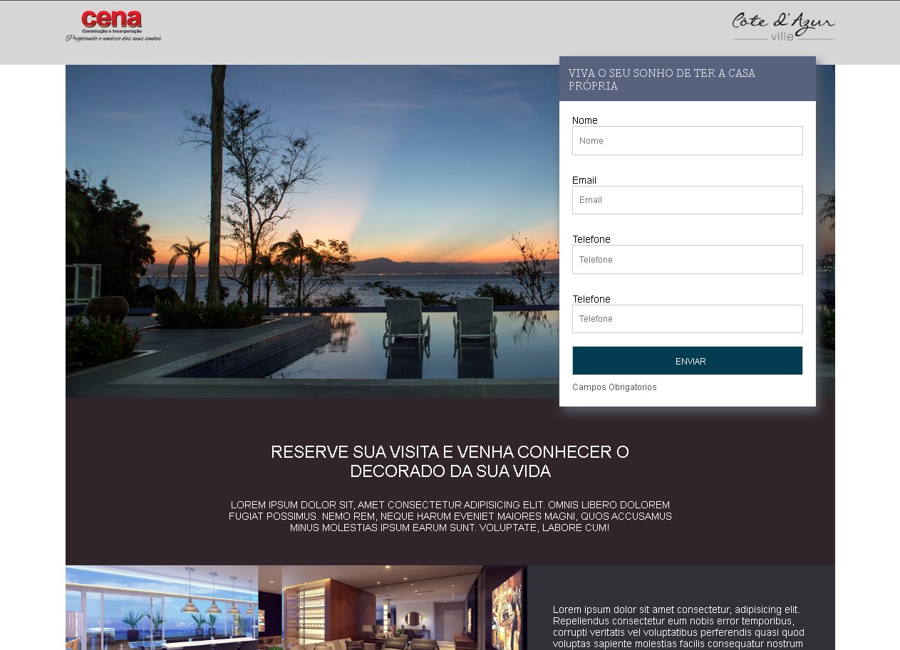
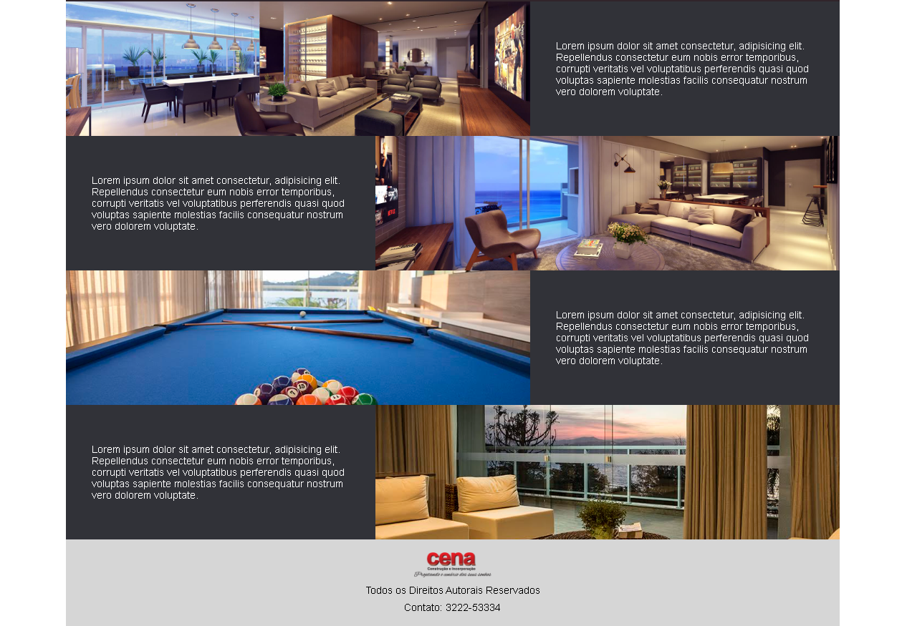

### Landingpage Responsiva HTML CSS Puro

Projeto conta com técnicas reponsivas de CSS como `pseudoclasses`, `posição estatica e relativa`, `tamanho máximo e mínimo`, `flutuação` e muito mais.

O projeto foi feito com base em containers de separação e divisões por sessão. Foi aplicado `conceitos de dimensão` de `bacground-image` e responsividade através de `@media screen`